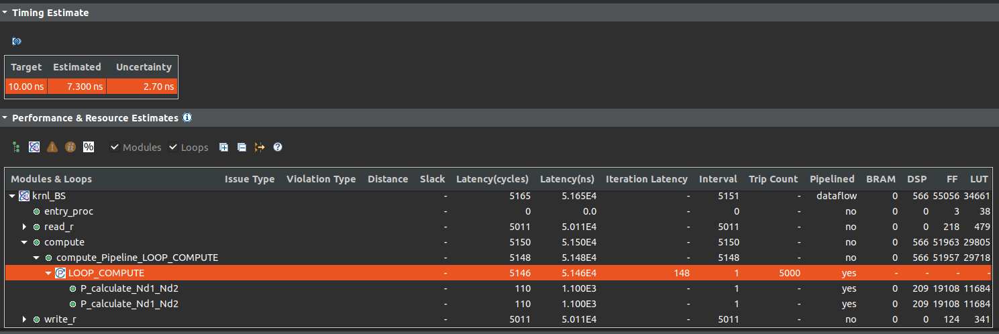

# Black Scholes FPGA

## Introduction
This is a repository of the work for my final assignment in the UNI for the MSc degree. Because i like trading stocks a lot i decided to implement the simple Black Scholes algorithm on CPU, GPU & FPGA to see gaining advancments!

## Todo:
- [x] Finish CPU implementation
- [x] Get a dataset
- [x] Check that fast CDF approximation is correct
- [x] Python version in order to run on GPU
- [x] Execute cuda version
- [x] Match cuda version to run with my dataset
- [ ] Intergrate Xilinx Makefile to mine
- [ ] Add all FPGA code & execute
- [ ] Profiling for the algorithm
- [ ] Contact Papaefstathiou & Aggelos after profiling


## Notes

For CPU comping with gnu compiler g++ and run
```
g++ main.cpp -o black_scholes.o
./black_scholes_cpu.o
```

```
g++ host.cpp -o host.o
./black_scholes_cpu.o
```

****
To see cuda specifications
```
nvcc gpu_info.cu -o gpu_info.o
./gpu_info.o
```

For cuda compile with nvcc and run
```
nvcc -I./common/inc BlackScholes.cu BlackScholes_gold.cpp -o black_scholes_cuda.o
./black_scholes_cuda.o
```
To create them all run "make" to start makefile.

## Comparisons

Times are reported in **ms**.

| Run         | Python      | C++         |
|-------------|-------------|-------------|
| 1           | 83.78       | 0.215180    |
| 2           | 86.064      | 0.212246    |
| 3           | 82.999      | 0.177605    |
| 4           | 81.916      | 0.217485    |
| 5           | 81.56       | 0.068165    |
| 6           | 81.144      | 0.177815    |
| 7           | 81.904      | 0.210710    |
| 8           | 82.483      | 0.085695    |
| 9           | 94.895      | 0.095403    |
| 10          | 86.902      | 0.131441    |
| **Average** | **84.3647** | **0.135917**|

The **Python** implementation is is **x620 times more slow** than **C++**!

****

Now the following comparison is between **fast_cdf_approximation** and **normal_cdf** functions:
| Run         | Fast Approximation| Normal CDF  |
|-------------|-------------------|-------------|
| 1           | 0.070818          | 0.215529    |
| 2           | 0.086184          | 0.075847    |
| 3           | 0.128787          | 0.184100    |
| 4           | 0.127878          | 0.072495    |
| 5           | 0.231174          | 0.187733    |
| 6           | 0.070958          | 0.094425    |
| 7           | 0.068235          | 0.132488    |
| 8           | 0.136400          | 0.096380    |
| 9           | 0.069562          | 0.101339    |
| 10          | 0.070050          | 0.135142    |
| **Average** | **0.1060046**     | **0.129548**|

The fast approximation seems to be **x1.22 times faster**
It would be even more helpfull due the the embedding nature of FPGA 
****

Finally the results from GPU side with CUDA are:
```
Executing Black-Scholes GPU kernel 1000 iterations...
Black Scholes GPU() average execution time: 0.001679 msec
Effective memory bandwidth: 10.220369 GB/s
Gigaoptions per second: 0.511018 

```
GPU IS <u>**x77.15 times faster**</u> than the best implementation so far on CPU from C++
and **x47833** from Python
****
### In order to run VITIS

Add the required sources
```
source /opt/xilinx/xrt/setup.sh
source /tools/Xilinx/Vitis/2022.1/settings64.sh
export CPATH="/usr/include/x86_64-linux-gnu/"
```

And one last command that maybe it is not needed if you place the alveo u200 to /tools/Xilinx/Vivado/2022.1/data/xhub/boards/XilinxBoardStore/boards/Xilinx
```
export PLATFORM_REPO_PATHS=/tools/Xilinx/Vivado/2022.1/data/boards/board_files
```

Makefile
```
make -f Makefile_FPGA all TARGET=sw_emu
```

The actual command for building host.cpp is probably:
```
g++ -o ./kernelBlackScholes ./common_fpga/includes/xcl2/xcl2.cpp ./host.cpp -I ./common_fpga/includes/xcl2 -I /tools/Xilinx/Vitis_HLS/2022.1/include -Wall -O0 -g -std=c++11 -lrt -lstdc++
```

Copy build
```
cp build_dir.sw_emu.xilinx_u200_gen3x16_xdma_2_202110_1/mmul.xclbin ./
export XCL_EMULATION_MODE=sw_emu
```
Start Vitis:
```
vitis_hls
```

In order to run the Simulation in Vitis:
* 10ns for 100MHz sim although u200 can achieve max 300MHz
* Select Alveo u200 from boards
  
The estimated simulation from Vitis regarding execution time is:
**7.3ns** so **7 times slower** than the GPU.



****
### Usefull Links
* [Black Scholes Wikipedia](https://en.wikipedia.org/wiki/Black%E2%80%93Scholes_model)
* [Tim Worrall Notes for Black Scholes](http://www.timworrall.com/fin-40008/bscholes.pdf)
* [Black Scholes Cuda by Nvidia](https://github.com/tpn/cuda-samples/tree/master/v9.0/4_Finance/BlackScholes)
* [Cuda Commands](https://docs.nvidia.com/cuda/cuda-runtime-api/group__CUDART__DEVICE.html#group__CUDART__DEVICE)
* [FPGA Platform Documentation](https://docs.amd.com/r/en-US/ug1120-alveo-platforms/U200-Gen3x16-XDMA-base_2-Platform)